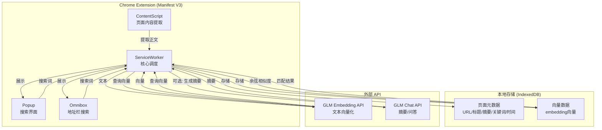
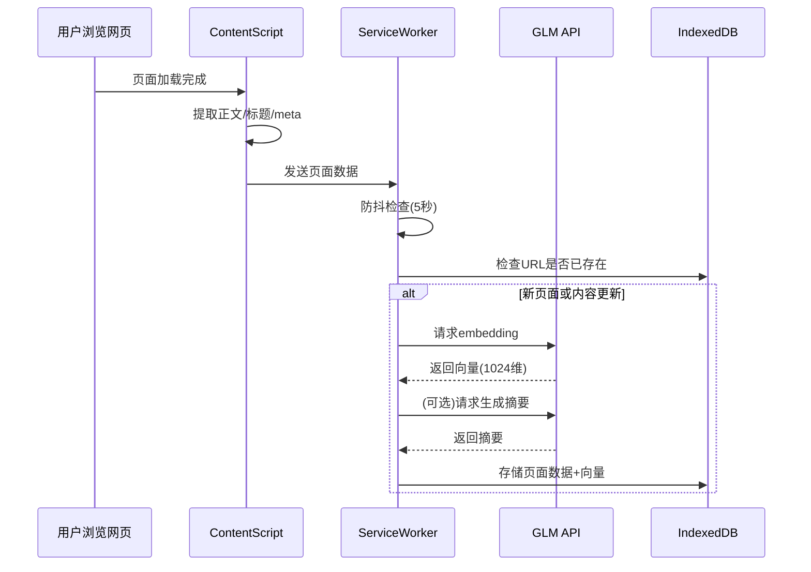
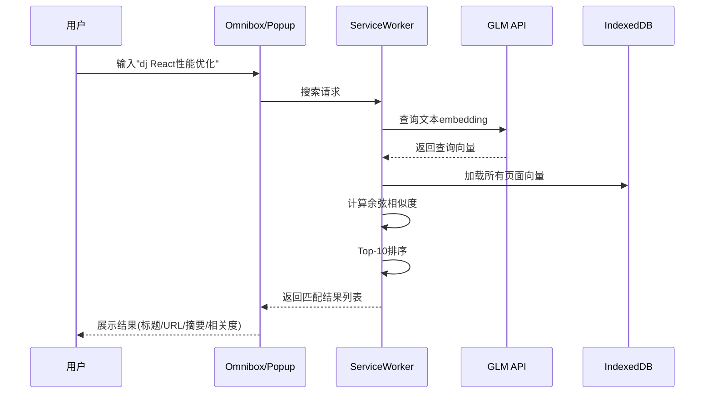

# Deja Browse (拾迹) - 智能浏览记忆 Chrome 插件方案

## 名字推荐


| 推荐度 | 名字  | 含义  |
| --- | --- | --- |


- **首选: Deja Browse (拾迹)** — 谐音 "Deja Vu"（似曾相识），寓意"我好像浏览过这个"，精准贴合产品定位。中文名"拾迹"意为拾起浏览的痕迹。
- **备选 1: MemWeave (织忆)** — Memory + Weave，编织记忆之网
- **备选 2: BrainCache (脑存)** — 大脑的缓存，技术感强
- **备选 3: Recall (溯忆)** — 简洁直白，回溯记忆

---

## 核心功能

1. **自动内容采集** — 浏览网页时自动提取正文、标题、关键词
2. **向量化存储** — 调用 GLM Embedding API 将内容向量化，存入本地 IndexedDB
3. **语义搜索** — 在地址栏(Omnibox)输入关键词，语义匹配历史浏览记录
4. **结果展示** — 弹窗展示匹配的历史网页列表（标题、URL、摘要、相关度）
5. **LLM 增强（可选）** — 用 GLM 生成页面摘要、智能问答

---

## 技术架构




---

## 项目结构

```
deja-browse/
├── manifest.json                 # Manifest V3 配置
├── package.json                  # 依赖管理
├── src/
│   ├── background/
│   │   └── service-worker.js     # 后台 Service Worker（核心调度）
│   ├── content/
│   │   └── content-script.js     # 内容提取脚本（注入到网页）
│   ├── popup/
│   │   ├── popup.html            # 弹窗搜索页面
│   │   ├── popup.css             # 样式
│   │   └── popup.js              # 搜索交互逻辑
│   ├── options/
│   │   ├── options.html          # 设置页面（API Key 等）
│   │   └── options.js
│   └── lib/
│       ├── extractor.js          # 网页正文提取 + 清洗
│       ├── glm-client.js         # 智谱 GLM API 客户端
│       ├── vector-store.js       # IndexedDB 向量存储层
│       ├── search.js             # 余弦相似度搜索引擎
│       └── utils.js              # 工具函数
├── assets/
│   └── icons/                    # 插件图标
└── README.md
```

---

## 关键技术决策

### 1. 内容提取 (`content-script.js`)

- 使用 `document.body.innerText` + DOM 解析提取正文
- 过滤导航栏、侧边栏、广告等无关内容（借助 `<article>`、`<main>` 等语义标签）
- 可引入 [Readability.js](https://github.com/mozilla/readability)（Mozilla 的正文提取库，Firefox Reader View 的核心）做更精准的正文提取
- 提取 `<title>`、`<meta description>`、`<h1>`-`<h3>` 作为辅助信息

### 2. 向量化 (GLM Embedding API)

- 调用智谱 AI 的 `embedding-3` 模型（1024维向量）
- API 端点: `https://open.bigmodel.cn/api/paas/v4/embeddings`
- 对页面内容截断到合理长度（如前 2000 字），避免 token 超限
- 批量处理 + 防抖：页面停留超过 5 秒才触发采集，避免快速跳转浪费 API 调用

### 3. 本地存储 (IndexedDB)

- 数据库名: `DejaBlowseDB`
- Object Store: `pages`
  - key: URL (去除 hash)
  - fields: `{ url, title, summary, keywords, content_snippet, vector: Float32Array, created_at, updated_at }`
- 使用 IndexedDB 原生 API 或轻量封装库 `idb`
- 向量以 `Float32Array` 存储，搜索时全量加载做余弦相似度（万级别页面完全可行）

### 4. 搜索引擎 (`search.js`)

```javascript
// 余弦相似度计算
function cosineSimilarity(vecA, vecB) {
  let dot = 0, normA = 0, normB = 0;
  for (let i = 0; i < vecA.length; i++) {
    dot += vecA[i] * vecB[i];
    normA += vecA[i] * vecA[i];
    normB += vecB[i] * vecB[i];
  }
  return dot / (Math.sqrt(normA) * Math.sqrt(normB));
}
```

- 搜索流程: 用户输入 → GLM embedding → 与本地所有向量计算余弦相似度 → Top-K 排序返回
- 万级别数据在浏览器端做暴力搜索，耗时在 50ms 以内，完全可接受
- 如果数据量增长到十万级，可考虑引入 [hnswlib-wasm](https://github.com/nickelc/hnswlib-wasm) 做近似最近邻搜索

### 5. 地址栏集成 (Omnibox API)

```json
// manifest.json
{
  "omnibox": { "keyword": "dj" }
}
```

- 用户在地址栏输入 `dj 关键词` 即可触发搜索
- 通过 `chrome.omnibox.onInputChanged` 实时返回建议列表
- 选中结果直接跳转到对应网页

### 6. GLM 集成 (`glm-client.js`)

- **Embedding**: 文本向量化，用于存储和搜索
- **Chat（可选增强）**: 
  - 自动生成页面摘要（50字以内）
  - 基于搜索结果做智能问答："我之前看过哪些关于 xxx 的文章？"
- API Key 通过 Options 页面配置，存储在 `chrome.storage.sync`

---

## 数据流程

### 采集流程（用户浏览时自动触发）




### 搜索流程（用户主动触发）




---

## 开发分期

### Phase 1: MVP（核心可用）

- Manifest V3 基础结构
- Content Script 正文提取（Readability.js）
- GLM Embedding 接入
- IndexedDB 存储
- Popup 搜索页面（简单输入框 + 结果列表）
- Omnibox 基础集成

### Phase 2: 体验优化

- 搜索结果高亮关键词
- 页面摘要生成（GLM Chat）
- 黑名单/白名单（排除特定网站）
- 数据统计面板（已收录页面数、存储大小）
- 手动触发收录（右键菜单"收录此页"）

### Phase 3: 高级功能

- 标签/分类管理
- 数据导出/导入
- 批量管理（删除、归档）
- 相似页面推荐（"与当前页面相关的历史页面"）
- 多模型支持（OpenAI、本地模型等）

---

## 技术栈总结

- **前端框架**: 原生 JS（轻量）或 Vue 3（如果 Popup 页面较复杂）
- **正文提取**: Mozilla Readability.js
- **向量化**: 智谱 GLM embedding-3 API
- **本地存储**: IndexedDB（通过 `idb` 库）
- **搜索算法**: 余弦相似度暴力搜索（万级数据）
- **构建工具**: Vite + CRXJS（Chrome 扩展开发友好）
- **Chrome API**: Omnibox, Storage, Tabs, Runtime messaging

