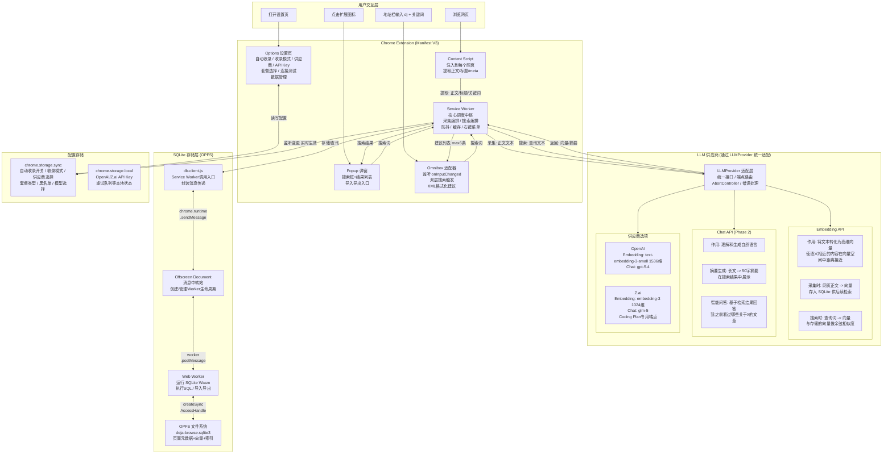
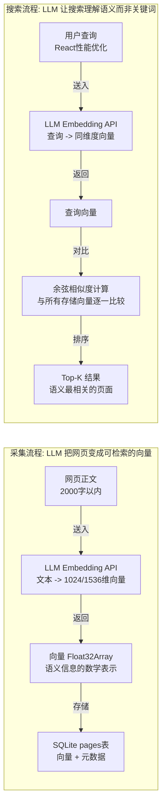
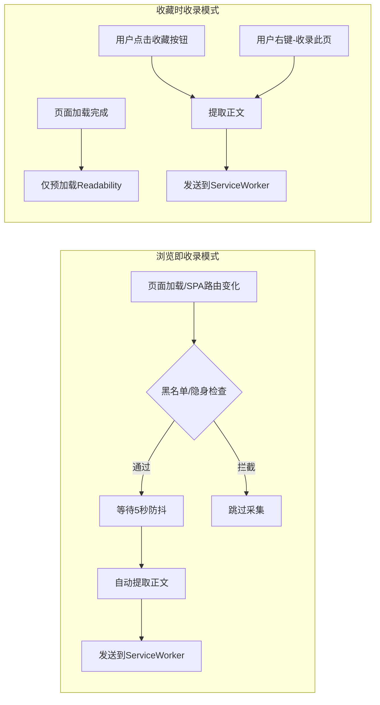
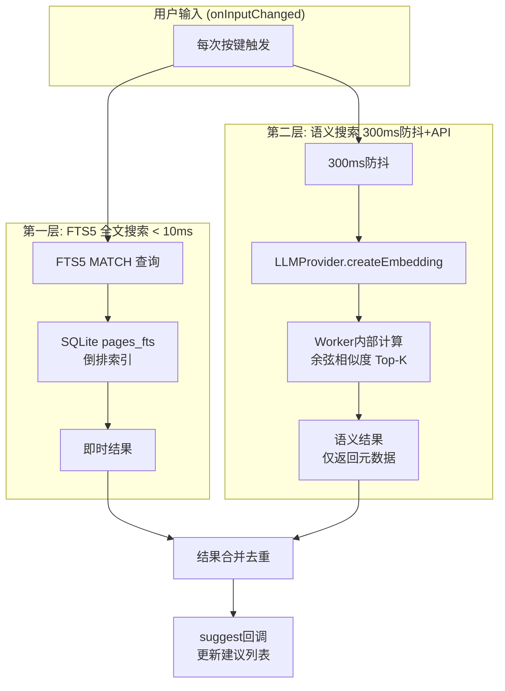
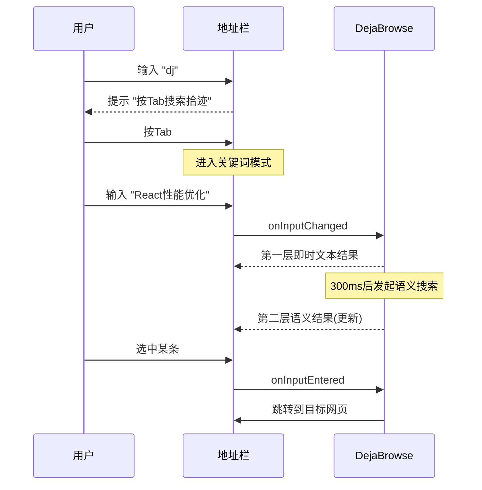
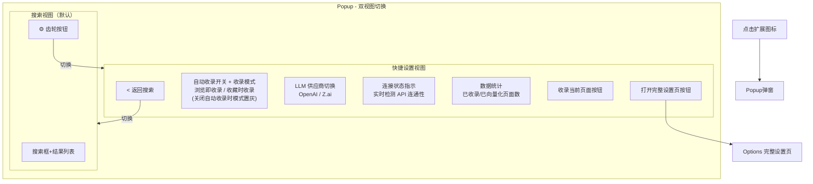
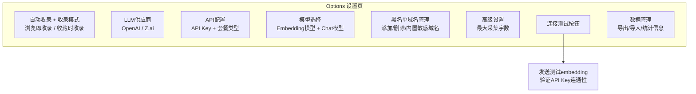
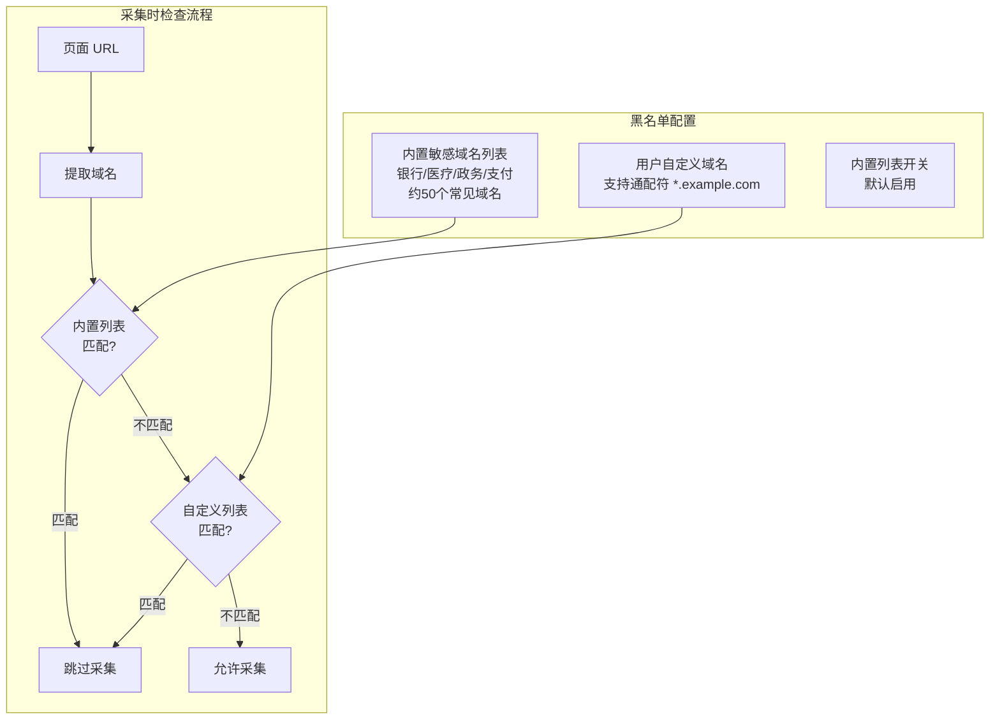
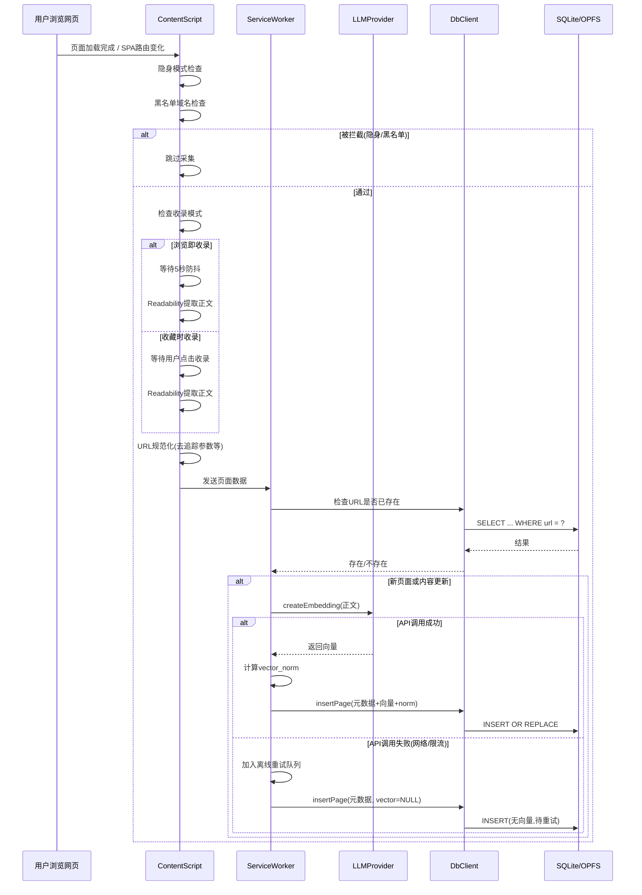
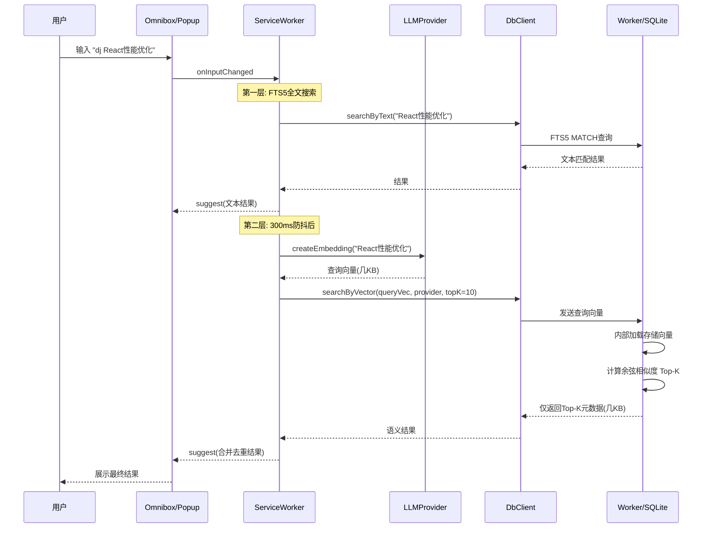

# Deja Browse (拾迹) - 智能浏览记忆 Chrome 插件完整方案

## 1. 产品定位

**Deja Browse (拾迹)** — 谐音 "Deja Vu"（似曾相识），寓意"我好像浏览过这个"。自动/手动采集浏览网页内容，向量化存储到本地，通过地址栏语义搜索快速找回历史页面。

## 2. 核心功能

1. **内容采集** — 两种模式：浏览即收录（自动）/ 收藏时收录（手动），并支持一键关闭自动收录
2. **向量化存储** — 调用 LLM Embedding API 将内容向量化，存入本地 OPFS SQLite 数据库
3. **Omnibox 地址栏搜索** — 输入 `dj` + Tab 触发，双层搜索（即时 FTS5 全文 + 异步语义），不与 Chrome 默认行为冲突
4. **Popup 搜索界面** — 弹窗展示匹配的历史网页列表（标题、URL、摘要、相关度）
5. **多供应商支持** — OpenAI (Codex) / Z.ai (ZAI) 双供应商，支持 Z.ai Coding Plan
6. **黑名单域名过滤** — 用户可配置不采集的域名列表，内置敏感域名默认过滤，支持通配符匹配
7. **数据导入导出** — 导出为 `.sqlite3` 文件或 JSON，支持从文件导入恢复
8. **LLM 增强（Phase 2）** — 页面摘要生成、智能问答

---

## 3. 技术架构

### 3.1 整体架构总览



### 3.2 LLM 在两大核心流程中的作用



**关键洞察**: LLM Embedding 的价值在于让搜索超越关键词匹配 — 即使用户搜"前端渲染优化"，也能找到标题为"React Fiber 架构解析"的页面，因为它们在向量空间中语义接近。

### 3.3 SQLite 存储层通信架构

MV3 的 Service Worker 不支持 `createSyncAccessHandle()`（OPFS 同步 API），因此需要 Offscreen Document 做中间层：

```mermaid
sequenceDiagram
    participant SW as ServiceWorker
    participant DBC as db-client.js
    participant OFF as OffscreenDocument
    participant WK as WebWorker
    participant DB as SQLite/OPFS

    Note over SW,DBC: 上层调用方只需关心 DbClient API
    SW->>DBC: dbClient.insertPage(page)
    DBC->>OFF: chrome.runtime.sendMessage
    OFF->>WK: worker.postMessage
    WK->>DB: INSERT OR REPLACE INTO pages ...
    DB-->>WK: OK
    WK-->>OFF: postMessage(result)
    OFF-->>DBC: sendResponse
    DBC-->>SW: Promise resolve
```

Offscreen Document 通过 `chrome.offscreen.createDocument()` 创建，设置 `reasons: ['WORKERS']` 以获得 Web Worker 创建权限。

### 3.4 模块职责速查

- **Content Script** — 注入到每个网页，用 Readability.js 提取正文、标题、meta 信息，根据自动收录开关与收录模式决定是否自动采集
- **Service Worker** — 核心调度中枢：编排采集流程（Content Script -> LLM -> DB）、编排搜索流程（Omnibox/Popup -> LLM + DB -> 结果）、管理防抖/缓存/配置监听/右键菜单
- **Popup** — 点击扩展图标弹出的搜索界面，展示搜索结果列表（标题/URL/摘要/相关度）；内嵌快捷设置面板（自动收录开关、收录模式切换、供应商切换、连接状态、手动收录当前页面），并提供"打开完整设置页"入口跳转 Options 页
- **Omnibox** — 地址栏 `dj` 前缀触发，双层搜索（即时 SQL 文本 + 异步语义向量），XML 格式化建议列表
- **Options** — 完整设置页面：自动收录开关、收录模式切换、LLM 供应商/API Key/套餐配置、连接测试、数据导入导出
- **LLMProvider** — 供应商适配层，统一 OpenAI 和 Z.ai 的 Embedding + Chat 接口，自动路由端点（含 Coding Plan）
- **db-client.js** — 数据库调用客户端，封装 Service Worker 到 SQLite 的三层消息传递
- **Offscreen Document** — SQLite 中转站，创建并管理 Web Worker 生命周期
- **Web Worker** — 运行 SQLite Wasm，通过 OPFS 同步 API 持久化数据库，执行所有 SQL 操作和导入导出
- **import-export.js** — 数据导入导出，支持 .sqlite3 原始文件和 JSON 两种格式，覆盖/合并两种策略

---

## 4. 项目结构

```
deja-browse/
├── manifest.json                 # Manifest V3 配置
├── package.json
├── vite.config.js                # Vite + CRXJS 构建
├── src/
│   ├── background/
│   │   └── service-worker.js     # 核心调度 + Omnibox 双层搜索
│   ├── content/
│   │   └── content-script.js     # 内容提取（支持两种收录模式）
│   ├── offscreen/
│   │   ├── offscreen.html        # Offscreen Document（SQLite 中转层）
│   │   └── offscreen.js          # 消息路由：SW <-> Web Worker
│   ├── db/
│   │   ├── db-worker.js          # Web Worker：运行 SQLite Wasm + OPFS
│   │   ├── db-client.js          # 供 SW/Popup 调用的数据库客户端（消息封装）
│   │   ├── schema.sql            # 建表语句
│   │   └── migrations.js         # 数据库迁移
│   ├── popup/
│   │   ├── popup.html            # 搜索界面 + 设置入口
│   │   ├── popup.css
│   │   └── popup.js
│   ├── options/
│   │   ├── options.html          # 完整设置页面
│   │   ├── options.css
│   │   └── options.js
│   └── lib/
│       ├── extractor.js          # Readability.js 正文提取 + 清洗
│       ├── llm-provider.js       # 多供应商适配层 (OpenAI / Z.ai)
│       ├── search.js             # 双层搜索引擎（SQL 文本 + 语义向量）
│       ├── import-export.js      # 数据导入导出（.sqlite3 / JSON）
│       ├── config.js             # 配置管理 (sync + local 分层)
│       └── utils.js              # LRU 缓存、防抖、工具函数
├── assets/
│   └── icons/                    # 16/48/128px 插件图标
└── README.md
```

---

## 5. 关键技术设计

### 5.1 内容提取 (content-script.js)

- 集成 [Readability.js](https://github.com/mozilla/readability)（Mozilla Firefox Reader View 核心库）做正文提取
- 提取 `title`、`meta description`、`h1`-`h3` 作为辅助信息
- 正文截断到配置的最大长度（默认 2000 字），避免 token 超限
- **URL 规范化**：去除 hash、移除追踪参数（`utm_*`、`ref`、`fbclid` 等）、统一尾部斜杠
- **SPA 支持**：监听 `popstate` 事件和拦截 `history.pushState`/`replaceState`，URL 变化时重新触发内容提取
- **隐身模式**：`manifest.json` 设置 `"incognito": "spanning"`，Content Script 通过 `CHECK_INCOGNITO` 消息让 Service Worker 返回 `sender.tab.incognito`，隐身模式下跳过采集
- 根据自动收录开关与收录模式决定行为：



#### URL 规范化函数

```javascript
function normalizeUrl(url) {
  const u = new URL(url);
  u.hash = '';
  // 移除常见追踪参数
  const trackingParams = ['utm_source', 'utm_medium', 'utm_campaign', 'utm_term',
    'utm_content', 'ref', 'fbclid', 'gclid', 'spm', 'from'];
  trackingParams.forEach(p => u.searchParams.delete(p));
  // 统一尾部斜杠
  u.pathname = u.pathname.replace(/\/+$/, '') || '/';
  return u.toString();
}
```

### 5.2 多供应商适配层 (llm-provider.js)

OpenAI 和 Z.ai 都兼容 OpenAI SDK 协议，通过统一的 `LLMProvider` 类适配：

```javascript
class LLMProvider {
  static create(config) {
    const providerConfig = config[config.provider];
    return new LLMProvider({
      provider: config.provider,
      apiKey: providerConfig.apiKey,
      baseUrl: LLMProvider.resolveBaseUrl(config),
      embeddingModel: providerConfig.embeddingModel,
      chatModel: providerConfig.chatModel,
    });
  }

  static resolveBaseUrl(config) {
    if (config.provider === 'openai') return config.openai.baseUrl;
    return config.zai.plan === 'coding'
      ? 'https://api.z.ai/api/coding/paas/v4'
      : 'https://api.z.ai/api/paas/v4';
  }

  async createEmbedding(text, signal) { /* POST /embeddings */ }
  async chat(messages, signal) { /* POST /chat/completions */ }
}
```

供应商参数：

- **OpenAI** — Embedding: `text-embedding-3-small` (1536维) / `text-embedding-3-large` (3072维) | Chat: `gpt-5.4` / `gpt-5.3-codex` | 端点: `https://api.openai.com/v1` | 计费: 按 token
- **Z.ai** — Embedding: `embedding-3` (1024维) | Chat: `glm-5` / `glm-4.5` | 端点(按量): `https://api.z.ai/api/paas/v4` | 端点(Coding Plan): `https://api.z.ai/api/coding/paas/v4` | 计费: 按量 或 Coding Plan

### 5.3 本地存储 (OPFS + SQLite Wasm)

使用 `@sqlite.org/sqlite-wasm` 官方包，数据库存储在 OPFS（Origin Private File System）中。

#### Manifest 配置要求

```json
{
  "permissions": ["offscreen"],
  "content_security_policy": {
    "extension_pages": "script-src 'self' 'wasm-unsafe-eval'; object-src 'self'"
  }
}
```

> 说明：当前实现未启用 COEP/COOP。仅在明确需要 SharedArrayBuffer 场景时再评估开启。

#### 数据库 Schema

```sql
-- schema.sql

-- 主表：页面元数据 + 向量
CREATE TABLE IF NOT EXISTS pages (
  url           TEXT PRIMARY KEY,     -- 规范化后的 URL
  title         TEXT NOT NULL,
  summary       TEXT,
  keywords      TEXT,                 -- 逗号分隔的关键词
  content_snippet TEXT,               -- 正文前 N 字
  vector        BLOB,                 -- embedding 向量（Float32Array 序列化）
  vector_norm   REAL,                 -- 预计算的向量 L2 范数，加速余弦相似度
  embedding_dim INTEGER,              -- 向量维度（1024 / 1536）
  provider      TEXT,                 -- 'openai' | 'zai'
  created_at    INTEGER NOT NULL,     -- Unix 时间戳
  updated_at    INTEGER NOT NULL
);

CREATE INDEX IF NOT EXISTS idx_pages_provider ON pages(provider);
CREATE INDEX IF NOT EXISTS idx_pages_created ON pages(created_at DESC);

-- FTS5 全文搜索虚拟表（替代 LIKE，支持中文按字拆分）
CREATE VIRTUAL TABLE IF NOT EXISTS pages_fts USING fts5(
  url,
  title,
  keywords,
  content_snippet,
  content='pages',
  content_rowid='rowid',
  tokenize='unicode61'
);

-- FTS 同步触发器：主表增删改时自动同步到 FTS 索引
CREATE TRIGGER IF NOT EXISTS pages_ai AFTER INSERT ON pages BEGIN
  INSERT INTO pages_fts(rowid, url, title, keywords, content_snippet)
  VALUES (new.rowid, new.url, new.title, new.keywords, new.content_snippet);
END;

CREATE TRIGGER IF NOT EXISTS pages_ad AFTER DELETE ON pages BEGIN
  INSERT INTO pages_fts(pages_fts, rowid, url, title, keywords, content_snippet)
  VALUES ('delete', old.rowid, old.url, old.title, old.keywords, old.content_snippet);
END;

CREATE TRIGGER IF NOT EXISTS pages_au AFTER UPDATE ON pages BEGIN
  INSERT INTO pages_fts(pages_fts, rowid, url, title, keywords, content_snippet)
  VALUES ('delete', old.rowid, old.url, old.title, old.keywords, old.content_snippet);
  INSERT INTO pages_fts(rowid, url, title, keywords, content_snippet)
  VALUES (new.rowid, new.url, new.title, new.keywords, new.content_snippet);
END;
```

使用 FTS5 替代 `LIKE '%keyword%'`（LIKE 前缀通配符无法命中 B-tree 索引，会退化为全表扫描）。FTS5 使用倒排索引，查询复杂度 O(1)，万级数据量 < 5ms。

#### 通信架构：db-client.js

Service Worker 和 Popup/Options 通过 `db-client.js` 与数据库交互，内部封装了消息传递：

```javascript
// db-client.js — 数据库操作客户端（仅暴露类型化方法，不暴露原始 SQL）
class DbClient {
  // 采集
  async insertPage(page) { /* INSERT OR REPLACE + 同步 FTS5 + 预计算 vector_norm */ }
  async pageExists(url) { /* SELECT 1 WHERE url = ? */ }

  // 搜索
  async searchByText(keyword, limit = 6) { /* FTS5: SELECT ... FROM pages_fts WHERE pages_fts MATCH ? */ }
  async searchByVector(queryVector, provider, topK = 10) {
    /* Worker 内部计算余弦相似度，仅返回 Top-K 元数据（不传输全部向量） */
  }

  // 数据管理
  async getStats() { /* 页面总数、数据库大小、各 provider 数量 */ }
  async exportDatabase(format) { /* 返回 Uint8Array (.sqlite3) 或 JSON */ }
  async importDatabase(bytes, format, strategy) { /* 导入并校验 */ }
  async deletePage(url) { /* 按 URL 删除 */ }
  async rebuildVectors(provider) { /* 标记所有记录为待重新索引 */ }
}
```

**关键设计决策 — 向量计算下沉到 Worker**：`searchByVector()` 将查询向量发送给 Worker，Worker 内部从 SQLite 加载存储的向量并完成余弦相似度计算，只返回 Top-K 结果的元数据（几 KB）。避免了将全部向量（万级约 40MB）通过 postMessage 跨上下文传输。

#### SQLite 相比 IndexedDB 的优势

- SQL 查询：`LIKE`、`ORDER BY`、`JOIN` 等复杂查询原生支持，文本搜索更灵活
- FTS5 全文搜索：后续可启用 SQLite FTS5 扩展做更精准的全文检索
- 单文件数据库：导入导出天然简单，直接序列化/反序列化整个 `.sqlite3` 文件
- 事务支持：批量写入更可靠

### 5.4 双层搜索引擎 (search.js)



- **第一层**：按键立即触发，FTS5 `MATCH` 查询匹配标题/关键词/URL，< 10ms 返回（FTS5 使用倒排索引，不同于 LIKE 的全表扫描）
- **第二层**：300ms 防抖后调用 Embedding API，查询向量发送到 Worker，Worker 内部加载存储向量并计算余弦相似度，仅返回 Top-K 元数据
- AbortController 取消上一次未完成的 API 请求
- LRU 缓存最近 100 条查询的 embedding，减少重复 API 调用

第一层 FTS5 查询：

```sql
-- FTS5 全文搜索（替代 LIKE '%keyword%'，性能提升 100 倍以上）
SELECT p.url, p.title, p.summary, p.keywords
FROM pages_fts fts
JOIN pages p ON fts.rowid = p.rowid
WHERE pages_fts MATCH 'React OR 性能 OR 优化'
ORDER BY rank
LIMIT 6
```

余弦相似度核心（在 Web Worker 内部执行，利用预计算的 `vector_norm` 加速）：

```javascript
// db-worker.js 中执行，避免跨消息链传输全部向量
function searchByVector(queryVec, provider, topK) {
  const queryNorm = Math.sqrt(queryVec.reduce((s, v) => s + v * v, 0));
  const rows = db.exec('SELECT url, title, summary, vector, vector_norm FROM pages WHERE provider = ?', [provider]);

  const scored = rows.map(row => {
    const storedVec = new Float32Array(row.vector);
    let dot = 0;
    for (let i = 0; i < queryVec.length; i++) dot += queryVec[i] * storedVec[i];
    return { url: row.url, title: row.title, summary: row.summary, score: dot / (queryNorm * row.vector_norm) };
  });

  return scored.sort((a, b) => b.score - a.score).slice(0, topK);
}
```

### 5.5 Omnibox 地址栏集成

**不与 Chrome 默认行为冲突** — Chrome Omnibox API 使用关键词前缀隔离机制：

1. 用户输入 `dj`，Chrome 提示 "按 Tab 搜索 拾迹"
2. 按 Tab 进入关键词模式，后续输入全部路由到插件
3. 按 Esc 退出，恢复 Chrome 正常行为

```json
{ "omnibox": { "keyword": "dj" } }
```

Omnibox 建议格式（XML 标签）：

```javascript
function formatSuggestions(results) {
  return results.slice(0, 5).map(r => ({
    content: r.url,
    description: `<match>${escapeXml(r.title)}</match> <dim>- ${escapeXml(truncate(r.summary, 60))}</dim> <url>${escapeXml(r.url)}</url>`
  }));
}
```

限制：最多 6 条建议，约 3 秒超时（双层搜索架构解决）。



### 5.6 设置与配置

#### Popup 内嵌快捷设置

点击扩展图标弹出 Popup，点击右上角齿轮图标可切换到**快捷设置面板**，无需离开弹窗即可完成常用配置：



快捷设置面板功能：
- **自动收录开关**：可一键关闭自动收录，关闭后仅保留手动收录
- **收录模式切换**：在开启自动收录时可切换「浏览即收录」/「收藏时收录」，立即生效
- **供应商切换**：快速切换 OpenAI / Z.ai，切换后自动重新检测连接
- **连接状态**：绿色/红色圆点实时显示当前 API 连通性
- **数据统计**：显示已收录页面数和已向量化页面数
- **收录当前页面**：手动触发采集当前浏览的网页
- **打开完整设置页**：跳转到 Options 页面配置 API Key、黑名单等详细选项

#### Options 完整设置页

通过 Popup 快捷设置中的「打开完整设置页」按钮，或 Chrome 扩展管理页的「选项」入口打开：



#### 配置存储分离（安全）

**API Key 等敏感数据存储在 `chrome.storage.local`（仅本地）**，非敏感配置存储在 `chrome.storage.sync`（跨设备同步）。`chrome.storage.sync` 会通过 Google 账号同步到云端，不能存储 API Key。

```javascript
// chrome.storage.sync — 非敏感配置（跨设备同步）
const syncConfig = {
  autoCollectEnabled: true,
  recordMode: 'auto',        // 'auto'(浏览即收录) | 'manual'(收藏时收录)
  provider: 'zai',           // 'openai' | 'zai'
  openai: {
    embeddingModel: 'text-embedding-3-small',
    chatModel: 'gpt-5.4',
    baseUrl: 'https://api.openai.com/v1',
  },
  zai: {
    plan: 'payg',            // 'payg' | 'coding'
    embeddingModel: 'embedding-3',
    chatModel: 'glm-5',
  },
  blacklist: {
    custom: [],              // 用户自定义黑名单域名
    builtinEnabled: true,    // 是否启用内置敏感域名
  },
  maxContentLength: 2000,
};

// chrome.storage.local — 敏感数据（仅本地，不同步到 Google 云端）
const localConfig = {
  'openai.apiKey': '',
  'zai.apiKey': '',
};
```

关键功能：

- **连接测试**: 发送测试 embedding 请求验证 API Key 有效性
- **实时生效**: `chrome.storage.onChanged` 监听，Service Worker 立即使用新配置
- **供应商切换提醒**: 切换供应商时提示"已有索引数据将需要重建"
- **重建索引**: 用新供应商模型重新生成所有页面的 embedding 向量
- **首次使用引导**: 安装后自动打开 Options 页引导配置 API Key
- **状态 badge**: 扩展图标用 `chrome.action.setBadgeText()` 显示当前页面采集状态（已收录/未收录/处理中）

### 5.7 黑名单域名管理

#### 黑名单架构



#### 内置敏感域名默认列表

```javascript
const BUILTIN_BLACKLIST = [
  // 银行/金融
  '*.bank.com', '*.icbc.com.cn', '*.ccb.com', '*.boc.cn', '*.abchina.com',
  'pay.weixin.qq.com', 'cashier.alipay.com',
  // 医疗健康
  '*.hospital.*', 'patient.*',
  // 政务
  '*.gov.cn', '*.gov',
  // 邮箱（可能含敏感通信）
  'mail.google.com', 'outlook.live.com', 'mail.qq.com',
  // 密码管理
  '*.1password.com', '*.lastpass.com', '*.bitwarden.com',
  // Chrome 内部页面
  'chrome://*', 'chrome-extension://*', 'about:*',
  // 本地开发
  'localhost', '127.0.0.1',
];
```

#### 通配符匹配逻辑

```javascript
function isDomainBlacklisted(url, blacklistConfig) {
  const hostname = new URL(url).hostname;

  const allPatterns = [
    ...(blacklistConfig.builtinEnabled ? BUILTIN_BLACKLIST : []),
    ...blacklistConfig.custom,
  ];

  return allPatterns.some(pattern => {
    if (pattern.startsWith('*.')) {
      // *.example.com 匹配 example.com 及所有子域名
      const base = pattern.slice(2);
      return hostname === base || hostname.endsWith('.' + base);
    }
    if (pattern.includes('*')) {
      // 转为正则：*.gov.* -> /^.*\.gov\..*$/
      const regex = new RegExp('^' + pattern.replace(/\./g, '\\.').replace(/\*/g, '.*') + '$');
      return regex.test(hostname);
    }
    return hostname === pattern;
  });
}
```

#### Options 页黑名单 UI

黑名单管理面板包含：
- **内置列表开关**: 一键启用/禁用所有内置敏感域名过滤
- **内置列表预览**: 可展开查看完整的内置域名列表（只读）
- **自定义域名输入**: 文本输入框 + 添加按钮，支持逐条添加
- **通配符提示**: 说明 `*.example.com` 匹配 `example.com` 及所有子域名
- **已添加列表**: 每条域名后有删除按钮
- **快捷操作**: "添加当前页面域名"按钮（从当前活动标签页提取域名）

---

## 6. 数据流程

### 采集流程



### 搜索流程



---

## 7. 数据导入导出 (import-export.js)

### 导出

两种导出格式：

**格式 1: SQLite 原始文件（推荐）**

- 调用 `sqlite3_js_db_export()` 获取数据库的 `Uint8Array`
- 通过 `chrome.downloads.download()` 保存为 `deja-browse-backup-{date}.sqlite3`
- 优点：完整保留所有数据（含向量），导入速度快，文件最小

**格式 2: JSON（可读 + 跨版本兼容）**

- 导出所有 `pages` 表记录为 JSON 数组
- 向量字段序列化为 Base64 字符串
- 适合数据迁移、调试查看

```mermaid
sequenceDiagram
    participant User as 用户
    participant OPT as Options页面
    participant DBC as DbClient
    participant WK as WebWorker
    participant DB as SQLite/OPFS

    User->>OPT: 点击"导出数据库"
    OPT->>DBC: exportDatabase(format)
    DBC->>WK: postMessage(export)
    alt SQLite格式
        WK->>DB: sqlite3_js_db_export()
        DB-->>WK: Uint8Array(原始字节)
    else JSON格式
        WK->>DB: SELECT * FROM pages
        DB-->>WK: 所有记录
        WK->>WK: 序列化为JSON
    end
    WK-->>OPT: Blob数据
    OPT->>OPT: 创建下载链接
    OPT-->>User: 下载文件
```

### 导入

```mermaid
sequenceDiagram
    participant User as 用户
    participant OPT as Options页面
    participant DBC as DbClient
    participant WK as WebWorker
    participant DB as SQLite/OPFS

    User->>OPT: 选择文件导入
    OPT->>OPT: 读取文件为ArrayBuffer
    OPT->>OPT: 检测格式(sqlite3/json)
    OPT->>DBC: importDatabase(bytes, format)
    DBC->>WK: postMessage(import, data)
    alt SQLite格式
        WK->>WK: 关闭当前数据库
        WK->>DB: 用导入数据覆盖OPFS文件
        WK->>WK: 重新打开数据库
        WK->>WK: 校验schema完整性
    else JSON格式
        WK->>WK: 解析JSON
        WK->>DB: BEGIN TRANSACTION
        WK->>DB: INSERT OR REPLACE 逐条写入
        WK->>DB: COMMIT
    end
    WK-->>OPT: 导入结果(成功/失败/条数)
    OPT-->>User: 提示导入完成
```

### 导入策略选择

导入时提供两种策略供用户选择：

- **覆盖模式**: 清空现有数据，完整替换为导入数据
- **合并模式**: 保留现有数据，仅导入不存在的页面（按 URL 去重）

### 关键代码

```javascript
// import-export.js

async function exportAsSqlite() {
  const bytes = await dbClient.exportDatabase();
  const blob = new Blob([bytes], { type: 'application/x-sqlite3' });
  const url = URL.createObjectURL(blob);
  await chrome.downloads.download({
    url,
    filename: `deja-browse-backup-${formatDate(new Date())}.sqlite3`,
    saveAs: true,
  });
  URL.revokeObjectURL(url);
}

async function exportAsJson() {
  const pages = await dbClient.query('SELECT * FROM pages');
  const data = pages.map(p => ({
    ...p,
    vector: p.vector ? arrayBufferToBase64(p.vector) : null,
  }));
  const blob = new Blob([JSON.stringify(data, null, 2)], { type: 'application/json' });
  // ... 同上下载逻辑
}

async function importFromFile(file, strategy = 'merge') {
  const buffer = await file.arrayBuffer();
  const isSqlite = new Uint8Array(buffer.slice(0, 16))
    .reduce((s, b) => s + String.fromCharCode(b), '')
    .startsWith('SQLite format 3');

  return dbClient.importDatabase(
    new Uint8Array(buffer),
    isSqlite ? 'sqlite' : 'json',
    strategy,
  );
}
```

---

## 8. 性能优化

- **向量计算下沉**: 余弦相似度计算在 Web Worker 内部执行，避免 40MB 向量数据跨 postMessage 传输
- **预计算 vector_norm**: 入库时计算并存储向量的 L2 范数，搜索时节省约 40% 计算量
- **FTS5 全文搜索**: 替代 LIKE 全表扫描，倒排索引使文本搜索从 O(n) 降到 O(1)，万级数据 < 5ms
- **Embedding LRU 缓存**: 最近 100 条查询的 embedding 做内存缓存，重复查询免 API 调用
- **AbortController 请求取消**: 每次新输入取消上一次未完成的 API 请求
- **消息链路自愈**: offscreen/worker 通道超时或断连时，自动重建 Offscreen Document 并重试
- **Offscreen 保活**: Offscreen Document 创建后保持存活，避免冷启动延迟
- **SQLite WAL 模式**: 启用 `PRAGMA journal_mode=WAL` 提升并发读写性能
- **万级以上扩展**: 考虑引入 [hnswlib-wasm](https://github.com/nickelc/hnswlib-wasm) 做近似最近邻搜索

---

## 9. 开发分期

### Phase 1: MVP 核心可用

- Manifest V3 + Vite + CRXJS 脚手架 + `@sqlite.org/sqlite-wasm` 依赖
- SQLite 存储层（Offscreen Document + Web Worker + OPFS + FTS5 全文索引）
- db-client.js 消息封装（类型化方法，向量计算在 Worker 内部）
- Content Script 正文提取（Readability.js）+ 自动收录开关 + 两种收录模式 + SPA 监听 + URL 规范化
- 黑名单域名管理（内置敏感域名 + 用户自定义 + 通配符匹配）
- 隐身模式跳过采集
- 多供应商适配层 `LLMProvider`（OpenAI + Z.ai，含 Coding Plan 端点切换）
- API Key 安全存储（`chrome.storage.local`，非同步）
- 双层搜索引擎（FTS5 全文匹配 + 语义向量搜索）
- Omnibox 地址栏集成（`dj` 前缀，双层搜索 + 防抖 + AbortController）
- Popup 搜索界面（搜索框 + 结果列表 + 状态 badge）
- Options 设置页（自动收录 + 收录模式 + 供应商 + API Key + 套餐 + 黑名单管理 + 连接测试）
- 数据导入/导出（.sqlite3 + JSON 两种格式）
- Embedding API 失败处理（离线队列 + 后台重试）
- 首次安装引导流程

### Phase 2: 体验优化

- 搜索结果高亮关键词
- 页面摘要生成（LLM Chat）
- 数据统计面板（已收录页面数、存储大小、各 provider 数量）
- 右键菜单"收录此页"
- 重建索引功能（切换供应商后批量重新生成向量）
- "添加当前页面域名到黑名单"快捷操作

### Phase 3: 高级功能

- 标签/分类管理
- 批量管理（删除、归档）
- 相似页面推荐（"与当前页面相关的历史页面"）
- 更多供应商扩展（本地模型等）
- 定时自动备份数据库
- 白名单模式（仅采集指定域名）

---

## 10. 技术栈总结

- **前端框架**: 原生 JS（轻量）或 Vue 3
- **正文提取**: Mozilla Readability.js
- **向量化**: OpenAI text-embedding-3 / Z.ai embedding-3
- **本地存储**: SQLite Wasm (@sqlite.org/sqlite-wasm) + OPFS
- **存储架构**: Offscreen Document + Web Worker（绕过 Service Worker 限制）
- **搜索算法**: SQL LIKE/FTS5 文本匹配 + 余弦相似度暴力搜索
- **构建工具**: Vite + CRXJS
- **Chrome API**: Omnibox, Offscreen, Storage, Tabs, Downloads, ContextMenus, Runtime messaging

---

## 11. 向量维度兼容策略

不同供应商 embedding 维度不同（OpenAI 1536 / Z.ai 1024），切换供应商时：

- SQLite `pages` 表每条记录存储 `provider` 和 `embedding_dim` 字段
- 搜索时仅对 `provider` 匹配当前供应商的记录做向量比较
- 提供"重建索引"功能，用新供应商重新生成所有向量（Options 页触发，后台批量执行）

---

## 12. 可靠性与容错设计

### Service Worker 生命周期管理

MV3 的 Service Worker 空闲约 5 分钟后会被 Chrome 终止。设计要点：

- **不做全量向量预加载到 SW 内存** — SW 随时可能被终止，内存会丢失
- **向量计算下沉到 Web Worker** — Worker 通过 Offscreen Document 保持存活，不受 SW 生命周期影响
- **Offscreen Document 自动重建** — db-client.js 在每次调用前检查 Offscreen Document 是否存活，不存活则自动重建
- **就绪状态检测** — SW 唤醒后首次搜索时，如果 Offscreen/Worker 尚未就绪，第一层 FTS5 搜索降级为空结果，第二层正常等待

### Embedding API 失败处理

```javascript
// 离线重试队列
const retryQueue = {
  async add(pageData) {
    const queue = await chrome.storage.local.get('retryQueue') || [];
    queue.push({ ...pageData, retryCount: 0, lastAttempt: Date.now() });
    await chrome.storage.local.set({ retryQueue: queue });
  },

  async processQueue() {
    const queue = await chrome.storage.local.get('retryQueue') || [];
    for (const item of queue) {
      if (item.retryCount >= 3) continue; // 最多重试 3 次
      try {
        const vector = await llmProvider.createEmbedding(item.content);
        await dbClient.updateVector(item.url, vector);
        // 成功，从队列移除
      } catch (e) {
        item.retryCount++;
        item.lastAttempt = Date.now();
      }
    }
  }
};

// 定时触发重试（SW 激活时 + 每 30 分钟）
chrome.alarms.create('retry-embeddings', { periodInMinutes: 30 });
chrome.alarms.onAlarm.addListener(alarm => {
  if (alarm.name === 'retry-embeddings') retryQueue.processQueue();
});
```

### COEP 策略说明

当前实现未启用 `cross_origin_embedder_policy` / `cross_origin_opener_policy`。现有 OPFS + sqlite-wasm 方案可在该配置下正常运行；后续若引入 SharedArrayBuffer 相关优化，再单独评估开启。

### 导入安全

导入 `.sqlite3` 文件前：
- 自动备份当前数据库
- 校验文件格式（magic bytes: "SQLite format 3"）
- 校验 schema 完整性（所有必要的表和字段存在）
- 失败时自动回滚到备份
